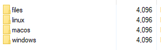
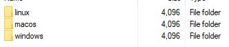

# FileUpdater

A Dart script that helps generate a JSON file for self-updating software. The JSON file contains data such as the file name, file type extension, hash, size, last modified timestamp, and a URL linked to the owner's host where the file is located and can be downloaded from.

## Prerequisites

The script is supported for any dart sdk within version 2.19.4 and 3.0.0.<br>
To install the dart sdk, please follow the respective instructions for your platform at https://dart.dev/get-dart.

## Usage

The script can be run using the Dart SDK. To generate a JSON file, simply run the script and it will scan the folder specified in the `kFolderPath` variable in the `Config` class for files to include in the JSON file. The `kHostPath` variable in the `Config` class specifies the URL where the file can be downloaded from.

To run the script, navigate to the project folder 'bin' and run the following command:
```dart
dart main.dart
```

## Configuration

The `Config` class contains the variables that can be configured to customize the behavior of the script. The `kFolderPath` variable specifies the folder where the script will look for files to include in the JSON file. The `kHostPath` variable specifies the URL where the file can be downloaded from.

```dart
class Config {
  static const kFolderPath = '/path/to/folder';
  static const kHostPath = 'https://example.com/files/';
}
```

To customize the configuration, edit the values of the variables in the Config class to match your requirements.

## Output

The script will generate a JSON file in the same folder as the script, named files.json. The JSON file will contain an array of objects, with each object representing a file in the folder specified in the kFolderPath variable. The properties of each object are:

* `file`: the file<br>
* `hash`: the hash of the file contents<br>
* `size`: the file size in bytes<br>
* `timestamp`: the last modified timestamp of the file<br>
* `url`: the URL where the file can be downloaded from<br>

Here's an example of the JSON file generated by the script:
```json
[
  {
    "file": "file1.txt",
    "hash": "e6c8c6e63c1677ef80ae708d789a51e5",
    "size": 1024,
    "timestamp": 1648876800000,
    "url": "https://example.com/files/file1.txt"
  },
  {
    "file": "file2.jpg",
    "hash": "d067aa26e6e1a20d06843dabdfc2a361",
    "size": 2048,
    "timestamp": 1648790400000,
    "url": "https://example.com/files/file2.jpg"
  }
]
```

## Implementation exemple
Let's say you have a folder '   bootstrap' on your local/remote host
and your software has three version 'linux', 'macos', and 'windows'.<br><br> 
Your need to create three folders that will hold the custom generated json file for each platforms (see 'Output').<br>
<br>

/!\ folder's name can be anything as long as they match in the 'files' folder! /!\ <br>

Inside the 'files' folder, the same folders must be created since it will be used to store the files that the user must download on their computer.<br>

## License
This project is licensed under the [GPLv3 License](https://github.com/NoIdeaIndustry/FileUpdater/blob/main/LICENSE). See the file for details.